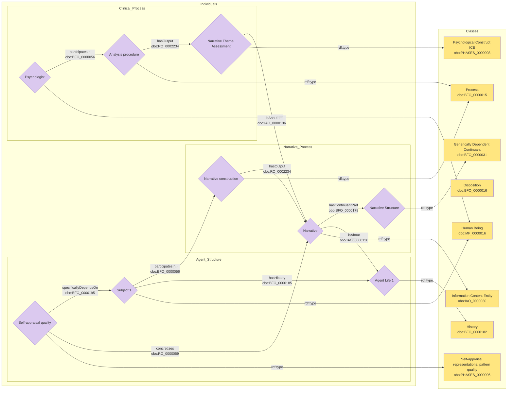

```mermaid
flowchart LR

%% =========================
%% CLASSES (TBOX)
%% =========================

subgraph Classes
direction TB
CCO_Agent[Human Being<br/>obo:MF_0000016]
History[History<br/>obo:BFO_0000182]
BFO_Process[Process<br/>obo:BFO_0000015]
BFO_Disposition[Disposition<br/>obo:BFO_0000016]
BFO_ICE[Information Content Entity<br/>obo:IAO_0000030]
Psych_construct[Psychological Construct ICE<br/>obo:PHASES_0000008]
Self[Self-appraisal representational pattern quality<br/>obo:PHASES_0000006]
GDC[Generically Dependent Continuant<br/>obo:BFO_0000031]
end


%% =========================
%% INDIVIDUALS (ABOX)
%% =========================

subgraph Individuals
direction LR

subgraph Agent_Structure
direction TB
Narrative_Agent_1{Subject 1}
Agent_Life_1{Agent Life 1}
Self1{Self-appraisal quality}
end

subgraph Narrative_Process
direction TB
Narrative_Construction{Narrative construction}
ICE_instance{Narrative}
Structure{Narrative Structure}
end

subgraph Clinical_Process
direction TB
Psychologist{Psychologist}
Analysis{Analysis procedure}
Narrative_Theme{Narrative Theme Assessment}
end

end


%% =========================
%% RDF:TYPES (NO CODES)
%% =========================

Narrative_Agent_1 -->|rdf:type| CCO_Agent
Psychologist -->|rdf:type| CCO_Agent
Agent_Life_1 -->|rdf:type| History
Narrative_Construction -->|rdf:type| BFO_Process
Analysis -->|rdf:type| BFO_Process
ICE_instance -->|rdf:type| BFO_ICE
Narrative_Theme -->|rdf:type| Psych_construct
Self1 -->|rdf:type| Self
Structure -->|rdf:type| GDC


%% =========================
%% ONTOLOGICAL RELATIONS
%% =========================

Narrative_Agent_1 -->|hasHistory<br/>obo:BFO_0000185| Agent_Life_1
Narrative_Agent_1 -->|participatesIn<br/>obo:BFO_0000056| Narrative_Construction

Narrative_Construction -->|hasOutput<br/>obo:RO_0002234| ICE_instance
ICE_instance -->|isAbout<br/>obo:IAO_0000136| Agent_Life_1
ICE_instance -->|hasContinuantPart<br/>obo:BFO_0000178| Structure

Psychologist -->|participatesIn<br/>obo:BFO_0000056| Analysis
Analysis -->|hasOutput<br/>obo:RO_0002234| Narrative_Theme
Narrative_Theme -->|isAbout<br/>obo:IAO_0000136| ICE_instance

Self1 -->|concretizes<br/>obo:RO_0000059| ICE_instance
Self1 -->|specificallyDependsOn<br/>obo:BFO_0000195| Narrative_Agent_1


%% =========================
%% STYLING
%% =========================

classDef yellow fill:#ffe680
classDef purple fill:#dbc9ef

class GDC,Psych_construct,CCO_Agent,BFO_Process,BFO_Disposition,BFO_ICE,Self,History yellow
class Structure,Narrative_Agent_1,Agent_Life_1,Part_of_Life_1,Disposition_1,Self1,Narrative_Construction,ICE_instance,Narrative_Theme,Psychologist,Analysis purple
```