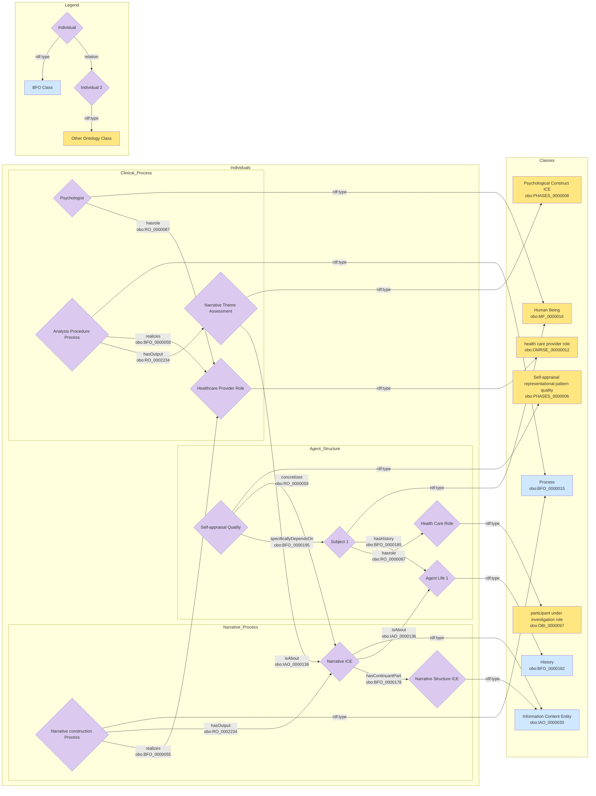

```mermaid
flowchart LR

%% =========================
%% CLASSES (TBOX)
%% =========================

subgraph Classes
direction TB
CCO_Agent[Human Being<br/>obo:MF_0000016]
History[History<br/>obo:BFO_0000182]
BFO_Process[Process<br/>obo:BFO_0000015]
BFO_ICE[Information Content Entity<br/>obo:IAO_0000030]
Psych_construct[Psychological Construct ICE<br/>obo:PHASES_0000008]
Self[Self-appraisal representational pattern quality<br/>obo:PHASES_0000006]
HealthRole[health care provider role<br/>obo:OMRSE_00000012]
HealthRole2[participant under investigation role<br/>obo:OBI_0000097]
end 

%% =========================
%% INDIVIDUALS (ABOX)
%% =========================

subgraph Individuals
direction LR

subgraph Agent_Structure
direction TB
Narrative_Agent_1{Subject 1}
Agent_Life_1{Agent Life 1}
Self1{Self-appraisal Quality}
Role2{Health Care Role}
end

subgraph Narrative_Process
direction TB
Narrative_Construction{Narrative construction Process}
ICE_instance{Narrative ICE}
Structure{Narrative Structure ICE}
end

subgraph Clinical_Process
direction TB
Psychologist{Psychologist}
Analysis{Analysis Procedure Process}
Narrative_Theme{Narrative Theme Assessment}
Role1{Healthcare Provider Role}
end

end


%% =========================
%% RDF:TYPES
%% =========================

Narrative_Agent_1 -->|rdf:type| CCO_Agent
Psychologist -->|rdf:type| CCO_Agent
Agent_Life_1 -->|rdf:type| History
Narrative_Construction -->|rdf:type| BFO_Process
Analysis -->|rdf:type| BFO_Process
ICE_instance -->|rdf:type| BFO_ICE
Narrative_Theme -->|rdf:type| Psych_construct
Self1 -->|rdf:type| Self
Structure -->|rdf:type| BFO_ICE
Role1 -->|rdf:type| HealthRole
Role2 -->|rdf:type| HealthRole2

%% =========================
%% ONTOLOGICAL RELATIONS
%% =========================

Narrative_Agent_1 -->|hasHistory<br/>obo:BFO_0000185| Agent_Life_1
Narrative_Agent_1 -->|hasrole<br/>obo:RO_0000087| Role2

Narrative_Construction -->|hasOutput<br/>obo:RO_0002234| ICE_instance
ICE_instance -->|isAbout<br/>obo:IAO_0000136| Agent_Life_1
ICE_instance -->|hasContinuantPart<br/>obo:BFO_0000178| Structure

Narrative_Construction -->|realizes<br/>obo:BFO_0000055| Role1
Analysis -->|realizes<br/>obo:BFO_0000055| Role1
Psychologist -->|hasrole<br/>obo:RO_0000087| Role1
Analysis -->|hasOutput<br/>obo:RO_0002234| Narrative_Theme
Narrative_Theme -->|isAbout<br/>obo:IAO_0000136| ICE_instance

Self1 -->|concretizes<br/>obo:RO_0000059| ICE_instance
Self1 -->|specificallyDependsOn<br/>obo:BFO_0000195| Narrative_Agent_1


%% =========================
%% LEGEND
%% =========================

subgraph Legend
direction TB

L_ind{Individual}
L_ind2{Individual 2}

L_bfo[BFO Class]

L_other[Other Ontology Class]

L_ind -->|rdf:type| L_bfo
L_ind2 -->|rdf:type| L_other
L_ind -->|relation| L_ind2

end


%% =========================
%% STYLING
%% =========================

classDef individual fill:#dbc9ef
classDef bfo fill:#cfe8ff
classDef ontology fill:#ffe680

%% BFO classes
class History,BFO_Process,BFO_ICE,GDC bfo

%% Other ontology classes
class CCO_Agent,Psych_construct,Self,HealthRole,HealthRole2 ontology

%% Individuals
class Structure,Role2,Role1,Narrative_Agent_1,Agent_Life_1,Self1,Narrative_Construction,ICE_instance,Narrative_Theme,Psychologist,Analysis individual

%% Legend styling
class L_ind,L_ind2 individual
class L_bfo bfo
class L_other ontology
```