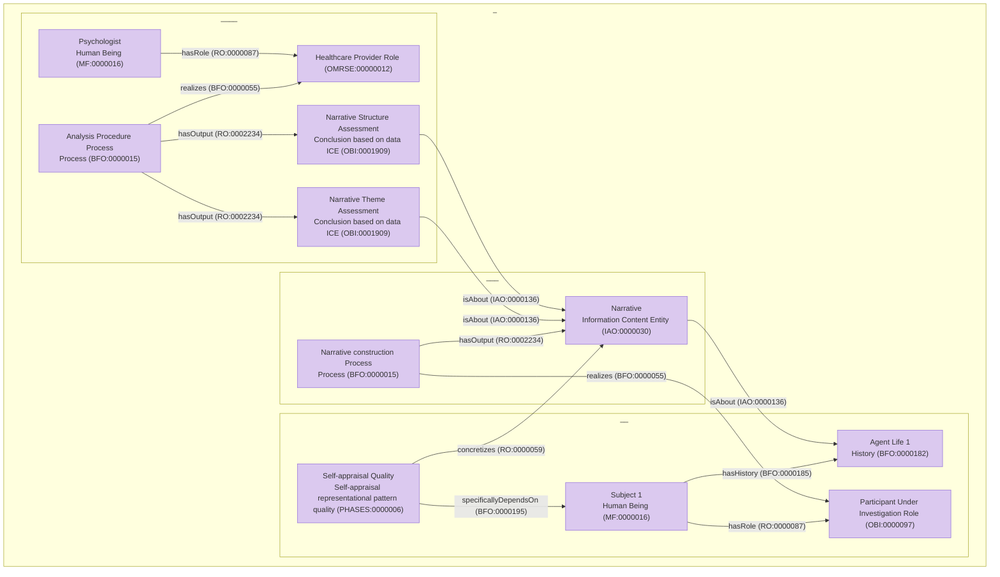

```mermaid
flowchart LR

%% =========================
%% PREFIXES (CURIEs)
%% =========================
%% bfo: http://purl.obolibrary.org/obo/BFO_
%% ro:  http://purl.obolibrary.org/obo/RO_
%% iao: http://purl.obolibrary.org/obo/IAO_
%% obi: http://purl.obolibrary.org/obo/OBI_
%% omrse: http://purl.obolibrary.org/obo/OMRSE_
%% mf: http://purl.obolibrary.org/obo/MF_
%% phases: http://purl.obolibrary.org/obo/PHASES_

%% =========================
%% INDIVIDUALS (ABOX ONLY)
%% =========================

subgraph _
direction LR

subgraph __
direction TB
Narrative_Agent_1["Subject 1\nHuman Being (MF:0000016)"]
Agent_Life_1["Agent Life 1\nHistory (BFO:0000182)"]
Self1["Self-appraisal Quality\nSelf-appraisal representational pattern quality (PHASES:0000006)"]
Role2["Participant Under Investigation Role (OBI:0000097)"]
end

subgraph ___
direction TB
Narrative_Construction["Narrative construction Process\nProcess (BFO:0000015)"]
ICE_instance["Narrative\nInformation Content Entity (IAO:0000030)"]
end

subgraph ____
direction TB
Psychologist["Psychologist\nHuman Being (MF:0000016)"]
Analysis["Analysis Procedure Process\nProcess (BFO:0000015)"]
Narrative_Theme["Narrative Theme Assessment\nConclusion based on data ICE (OBI:0001909)"]
Narrative_Structure_Assessment["Narrative Structure Assessment\nConclusion based on data ICE (OBI:0001909)"]
Role1["Healthcare Provider Role (OMRSE:00000012)"]
end

end

%% =========================
%% RELATIONS (CURIEs)
%% =========================

Narrative_Agent_1 -->|"hasHistory (BFO:0000185)"| Agent_Life_1
Narrative_Agent_1 -->|"hasRole (RO:0000087)"| Role2

Narrative_Construction -->|"hasOutput (RO:0002234)"| ICE_instance
ICE_instance -->|"isAbout (IAO:0000136)"| Agent_Life_1

Narrative_Construction -->|"realizes (BFO:0000055)"| Role2
Analysis -->|"realizes (BFO:0000055)"| Role1
Psychologist -->|"hasRole (RO:0000087)"| Role1

Analysis -->|"hasOutput (RO:0002234)"| Narrative_Theme
Analysis -->|"hasOutput (RO:0002234)"| Narrative_Structure_Assessment

Narrative_Theme -->|"isAbout (IAO:0000136)"| ICE_instance
Narrative_Structure_Assessment -->|"isAbout (IAO:0000136)"| ICE_instance

Self1 -->|"concretizes (RO:0000059)"| ICE_instance
Self1 -->|"specificallyDependsOn (BFO:0000195)"| Narrative_Agent_1

%% =========================
%% STYLING
%% =========================

classDef individual fill:#dbc9ef

class Narrative_Agent_1,Agent_Life_1,Self1,Role2,Narrative_Construction,ICE_instance,Psychologist,Analysis,Narrative_Theme,Narrative_Structure_Assessment,Role1 individual
```