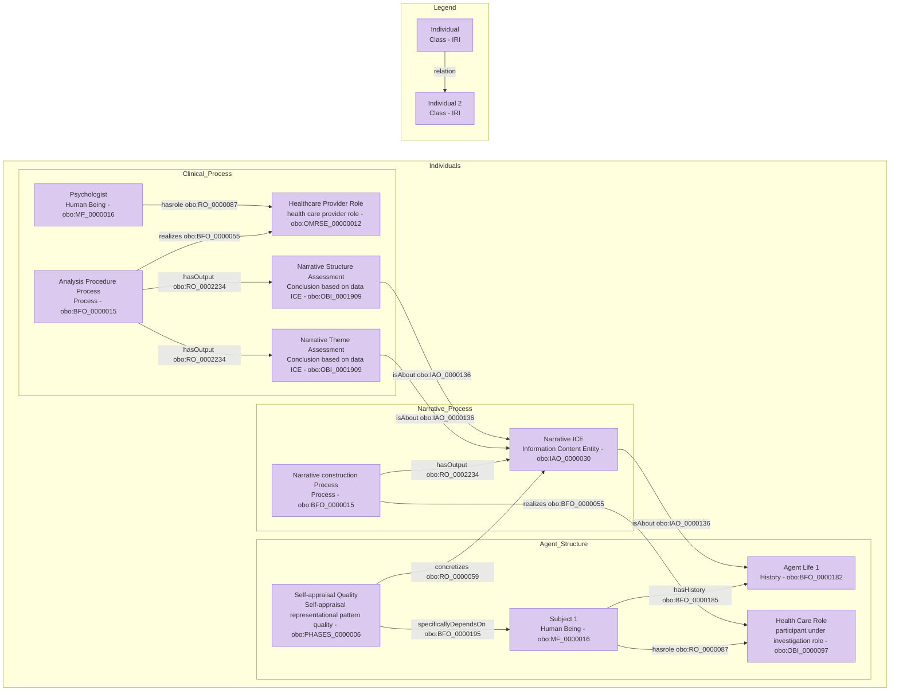

```mermaid
flowchart LR

%% =========================
%% INDIVIDUALS (ABOX ONLY)
%% =========================

subgraph Individuals
direction LR

subgraph Agent_Structure
direction TB
Narrative_Agent_1[Subject 1\nHuman Being - obo:MF_0000016]
Agent_Life_1[Agent Life 1\nHistory - obo:BFO_0000182]
Self1[Self-appraisal Quality\nSelf-appraisal representational pattern quality - obo:PHASES_0000006]
Role2[Health Care Role\nparticipant under investigation role - obo:OBI_0000097]
end

subgraph Narrative_Process
direction TB
Narrative_Construction[Narrative construction Process\nProcess - obo:BFO_0000015]
ICE_instance[Narrative ICE\nInformation Content Entity - obo:IAO_0000030]
end

subgraph Clinical_Process
direction TB
Psychologist[Psychologist\nHuman Being - obo:MF_0000016]
Analysis[Analysis Procedure Process\nProcess - obo:BFO_0000015]
Narrative_Theme[Narrative Theme Assessment\nConclusion based on data ICE - obo:OBI_0001909]
Narrative_Structure_Assessment[Narrative Structure Assessment\nConclusion based on data ICE - obo:OBI_0001909]
Role1[Healthcare Provider Role\nhealth care provider role - obo:OMRSE_00000012]
end

end


%% =========================
%% RELATIONS
%% =========================

Narrative_Agent_1 -->|hasHistory obo:BFO_0000185| Agent_Life_1
Narrative_Agent_1 -->|hasrole obo:RO_0000087| Role2

Narrative_Construction -->|hasOutput obo:RO_0002234| ICE_instance
ICE_instance -->|isAbout obo:IAO_0000136| Agent_Life_1

Narrative_Construction -->|realizes obo:BFO_0000055| Role2
Analysis -->|realizes obo:BFO_0000055| Role1
Psychologist -->|hasrole obo:RO_0000087| Role1

Analysis -->|hasOutput obo:RO_0002234| Narrative_Theme
Analysis -->|hasOutput obo:RO_0002234| Narrative_Structure_Assessment

Narrative_Theme -->|isAbout obo:IAO_0000136| ICE_instance
Narrative_Structure_Assessment -->|isAbout obo:IAO_0000136| ICE_instance

Self1 -->|concretizes obo:RO_0000059| ICE_instance
Self1 -->|specificallyDependsOn obo:BFO_0000195| Narrative_Agent_1


%% =========================
%% LEGEND
%% =========================

subgraph Legend
direction TB

L_ind[Individual\nClass - IRI]
L_ind2[Individual 2\nClass - IRI]

L_ind -->|relation| L_ind2

end


%% =========================
%% STYLING
%% =========================

classDef individual fill:#dbc9ef

class Narrative_Agent_1,Agent_Life_1,Self1,Role2,Narrative_Construction,ICE_instance,Psychologist,Analysis,Narrative_Theme,Narrative_Structure_Assessment,Role1 individual
class L_ind,L_ind2 individual
```